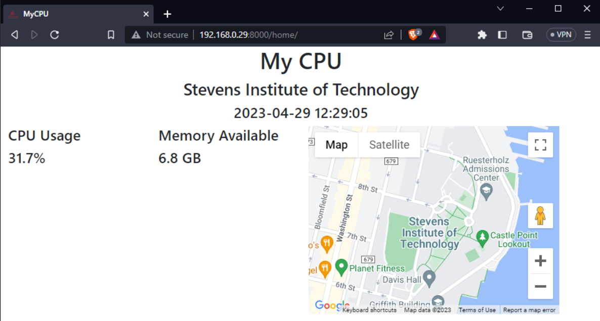

# stevens
## Entering a new temperature reading from the admin page

## Viewing the app on localhost

## Viewing the app from a separate device

# mycpu
## Entering a new location from the admin page

## Viewing the app on localhost

## Viewing the app from a separate device

