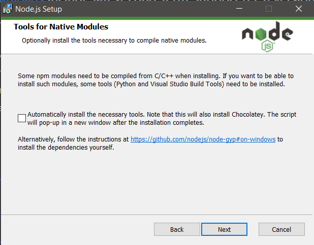

# Lab 6: Node.js and Pystache
## From Prof. Lu's GitHub Repo:
### Instructions
1. Study the GitHub [repository](https://github.com/kevinwlu/iot) Lesson 6
2. Install [Node.js](https://nodejs.org/dist/v18.16.0/node-v18.16.0-x64.msi) and run hello-world.js, hello.js, and http.js
   - When using the Node.js wizard, leave the box shown below unchecked to prevent Python from being overwritten
   
   - Open a terminal in the `~\Appdata\Roaming\npm` directory, which is also specified in the latest Path variable
   ```sh
   $ npm install -g node-gyp
   ```
   - Install [Visual Studio Build Tools](https://visualstudio.microsoft.com/thank-you-downloading-visual-studio/?sku=BuildTools) (recommended but might not be necessary)
   - Configure the Python dependency: Edit Environment Variables > New > Name: `PYTHON`, Value: `~\Python\Python39\`
   ```sh
   $ node -v
   $ npm -v
   $ node -h
   $ cd ~\iot\lesson6
   $ node hello-world.js
   ```
   - View the webpage at http://127.0.0.1:3000/
   ```sh
   $ node hello.js
   ```
   - View the webpage at http://127.0.0.1:8080/
   ```sh
   $ node http.js
   ```
   - Refresh the webpage at http://127.0.0.1:8080/ or http://localhost:8080/ to see server activities
3. Install Pystache and run say_hello.py that uses the template in say_hello.mustache
   ```sh
   $ python -m pip install pystache
   $ cd ~/iot/lesson6
   $ cat say_hello.mustache
   $ cat say_hello.py
   $ py -3.9 say_hello.py
   ```
### [Lesson 6: Alternative Devices](lesson6/README.md)
