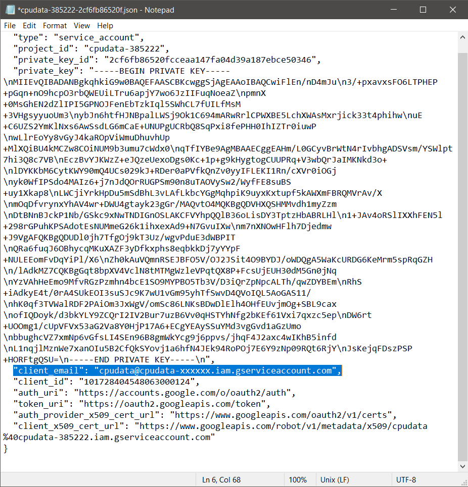

# Lab 7: ThingSpeak and Google Sheets
## From Prof. Lu's GitHub Repo:
### Instructions
1. Study the GitHub [repository](https://github.com/kevinwlu/iot) Lesson 7
2. Sign up and log in MathWorks [ThingSpeak](https://thingspeak.com/)
   - Create new channel cpu_loop with field1 cpu_pc and field2 mem_avail_mb
   - Copy the Write API Key from [channels](https://thingspeak.com/channels)
   <!--KLNN2NC7GQHP3FV3-->
3. Run thingspeak_cpu_loop.py or thinkspeak_feed.py in a demo folder
   ```sh
   $ mkdir demo
   $ cd ~\demo
   $ cp ~\iot\lesson7\thingspeak_cpu_loop.py .
   $ cp ~\iot\lesson7\thingspeak_feed.py .
   $ cat thingspeak_cpu_loop.py
   $ cat thingspeak_feed.py
   $ py -3.9 thingspeak_feed.py
   An API key savefile was not found. Enter Write API Key >>>
   Should we save this key for future use? [y/N] >>> y
   ```
4. Install gspread and oauth2client
   ```sh
   $ python -m pip install gspread oauth2client
   ```
5. Log in the [Google Cloud Platform Identity and Access Management](https://console.developers.google.com/projectselector/iam-admin/iam), create a project cpudata, enable both Drive API and Sheets API, create and download service account JSON key file
   - Credential > Create Credentials > Service account > Service account ID: `cpudata`
   - On the Credentials page, click on the name of the new service account
   - Keys > Add Key > Create new key > Key Type: JSON
   - The JSON key should download automatically
   - Replacing `*` with the JSON key number:
   ```sh
   $ mv ~\Downloads\cpudata-*.json ~\demo
   ```
6. Start a new Google sheet cpudata, share it with the client email in the JSON file, delete Rows 2 to 1000, and edit the header cells
   - The line with the client email is highlighted in the image below
   
   - Enter `Date / Time`, `CPU Usage %`, `Memory Available GB` to header cells
7. Run cpu_spreadsheet.py with the JSON key file in a demo folder
   ```sh
   $ cd ~\demo
   $ cp ~\iot\lesson7\cpu_spreadsheet.py .
   $ nano cpu_spreadsheet.py
   ```
   - Change `'cpudata-xxxxxxxxxxxx.json'` to your own JSON key
   ```sh
   $ py -3.9 cpu_spreadsheet.py
   ```
   - Allow this program to run for about 2 hours to obtain sufficient data for the next lab
### [Lesson 7: Cloud Platforms](lesson7/README.md)
