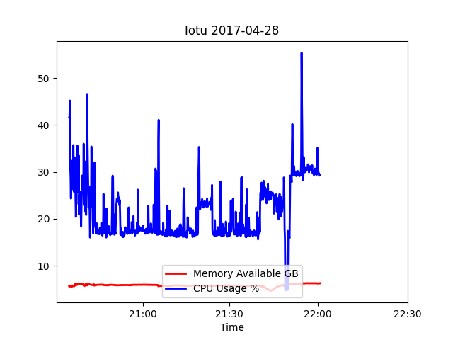
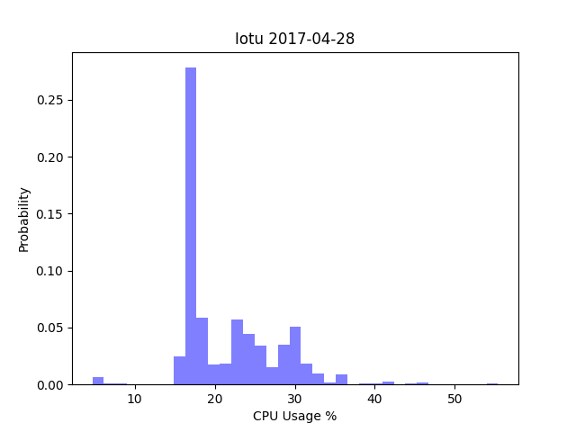
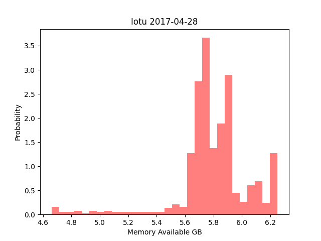
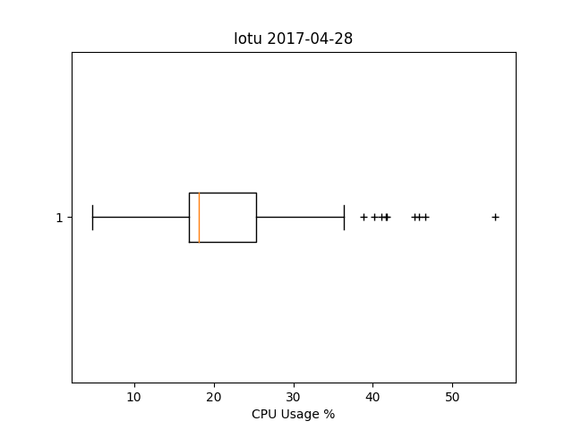
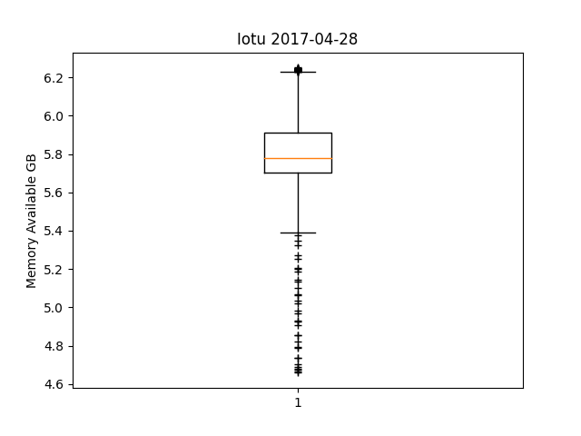
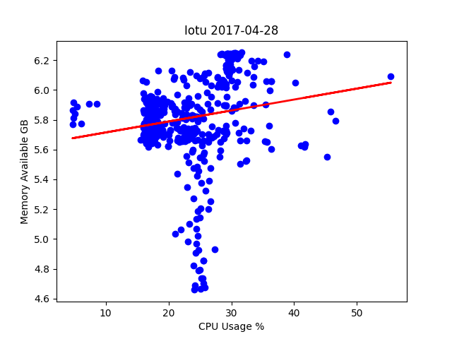
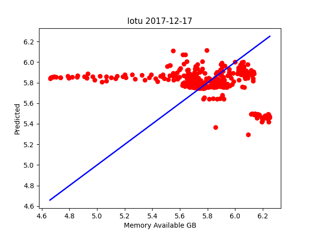

# plt_final
## Time series, CPU usage and memory availability

## Histogram of CPU usage

## Histogram of memory availability

## Horizontal box plot of CPU usage

## Vertical box plot of memory availability

## Scatter diagram with a linear regression line

# plt_cv2
## Cross-validation prediction with memory availability as target

