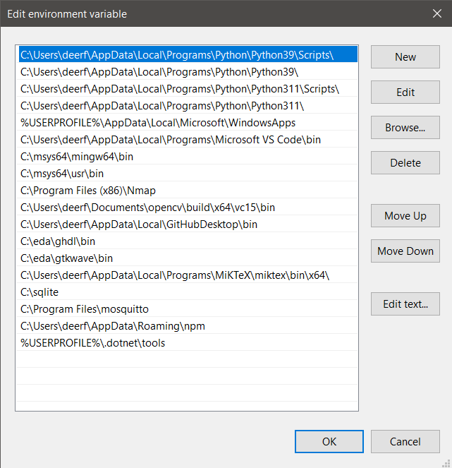

# Lab 9: YANG
### [Results](Results.md)
## From Prof. Lu's GitHub Repo:
### Instructions
1. Study the GitHub [repository](https://github.com/kevinwlu/iot) Lesson 9
2. Install pyang and PlantUML
   ```sh
   $ python -m pip install pyang plantuml
   ```
3. Copy ~/iot/lesson9/intrusiondetection.yang to ~/demo
   - You can make the `demo` directory using `mkdir` if you do not have one already
   ```sh
   $ cd ~\demo
   $ cp ~\iot\lesson9\intrusiondetection.yang .
   ```
4. Run pyang to generate intrusiondetection.yin and intrusiondetection.uml
   - Go to your Environment Variables, and go to Path to find the path to the Python `Scripts` directory
   
   - This should be similar to the path highlighted in the image
   - Copy this path, which will be called `C:\PATH_TO_PYANG\` for the rest of this tutorial
   - The `cat` lines will show an error if you do not do this correctly
   ```sh
   $ py -3.9 C:\PATH_TO_PYANG\pyang -f yin -o intrusiondetection.yin intrusiondetection.yang
   $ cat intrusiondetection.yin
   $ py -3.9 C:\PATH_TO_PYANG\pyang -f uml -o intrusiondetection.uml intrusiondetection.yang --uml-no=stereotypes,annotation,typedef
   $ cat intrusiondetection.uml
   ```
5. Run PlantUML to generate intrusiondetection.png
   ```sh
   $ py -3.9 -m plantuml intrusiondetection.uml
   ```
   - `intrusiondetection.png` will be inside the `~\demo` directory
### [Lesson 9: YANG and Qiskit](lesson9/README.md)
