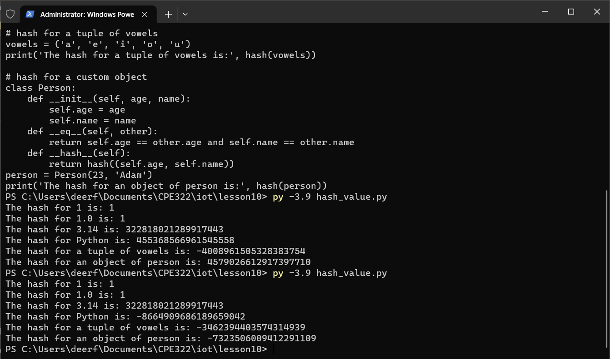
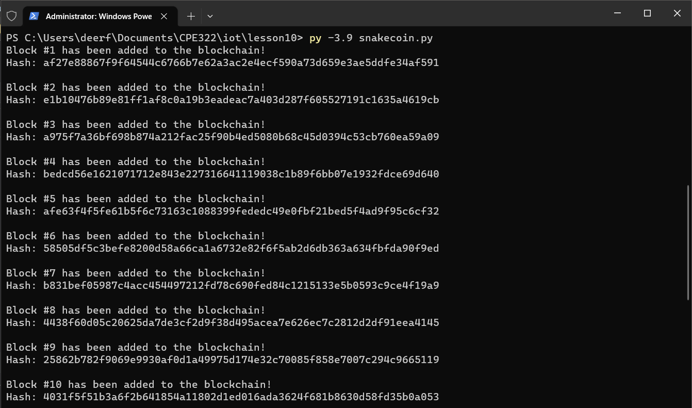
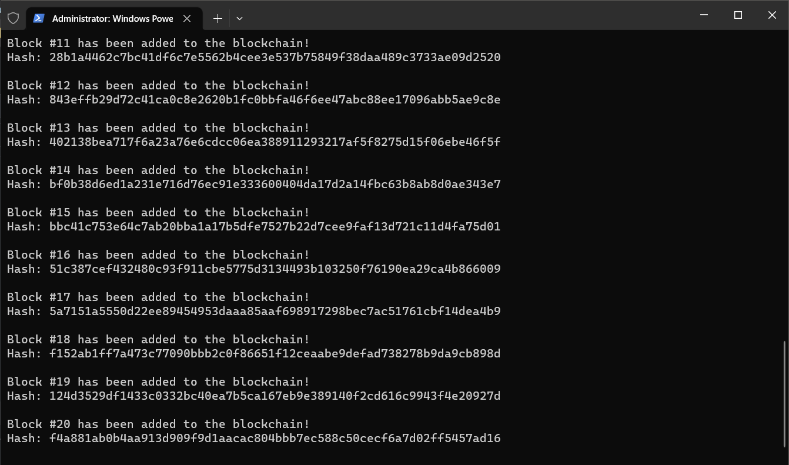
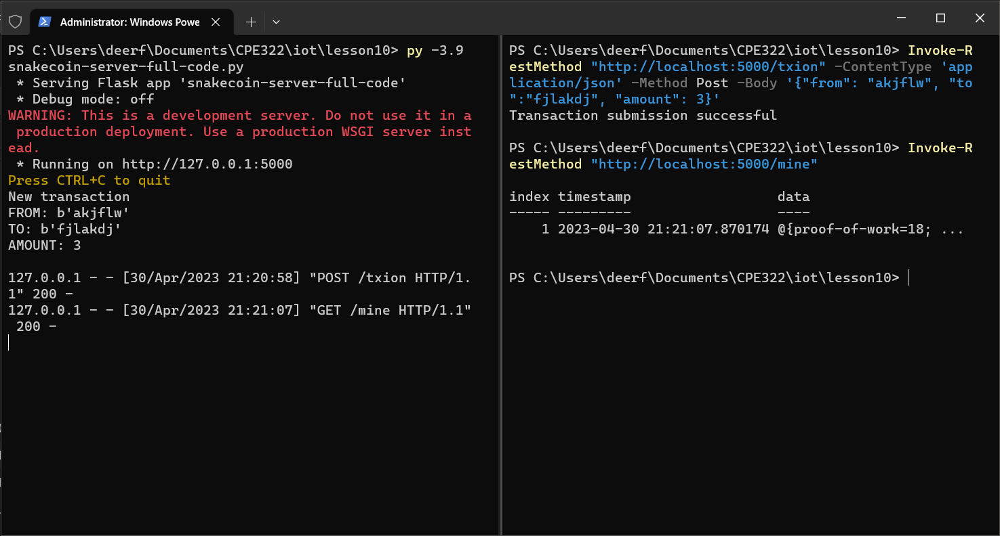
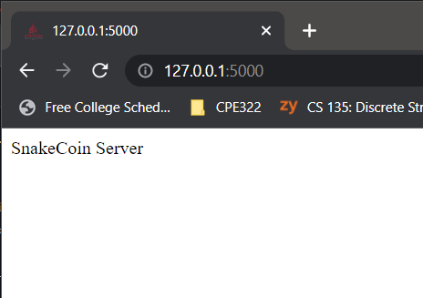
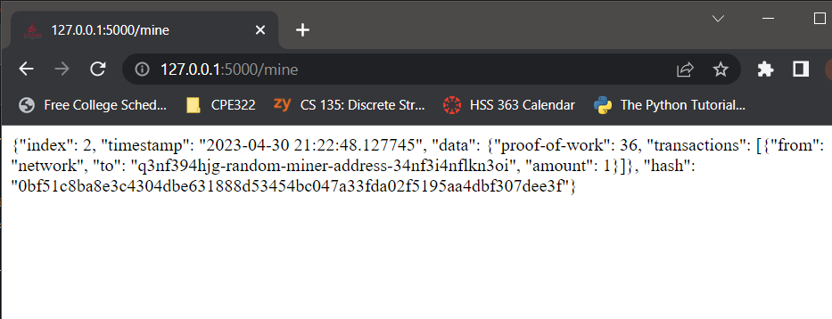
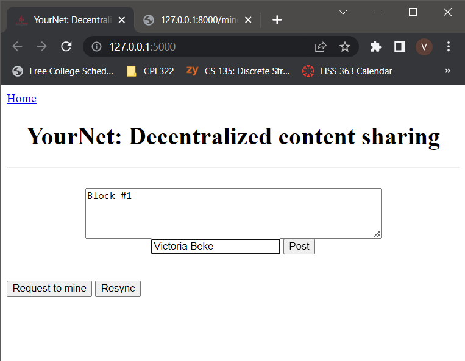
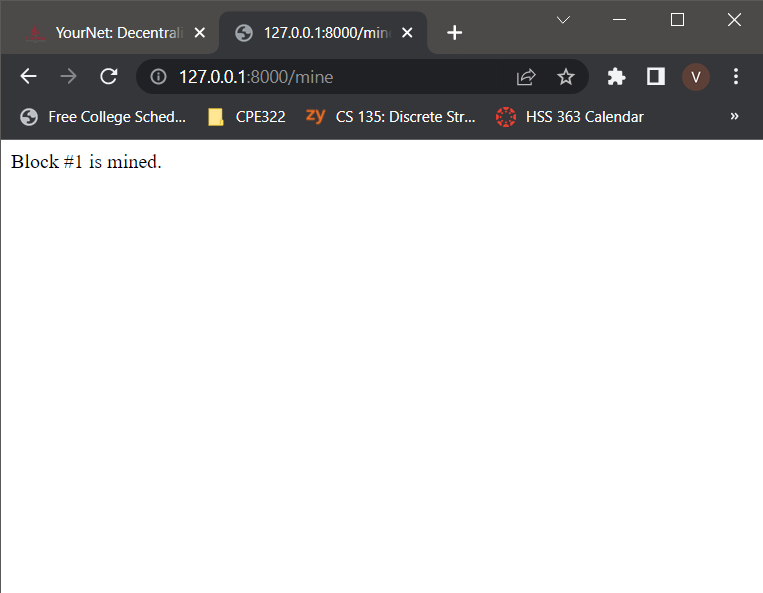
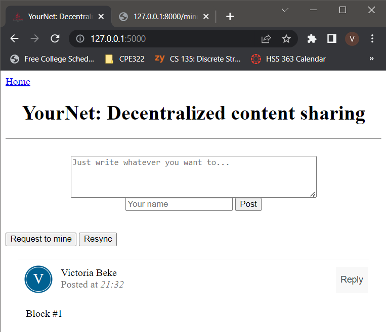

# Hash value

# SnakeCoin

## SnakeCoin Server
### Creating a transaction and mining a block from the terminal

### SnakeCoin Server page

### SnakeCoin Mining page

# YourNet
## Requesting to mine

## Viewing the mined block

## Resyncing the original page

